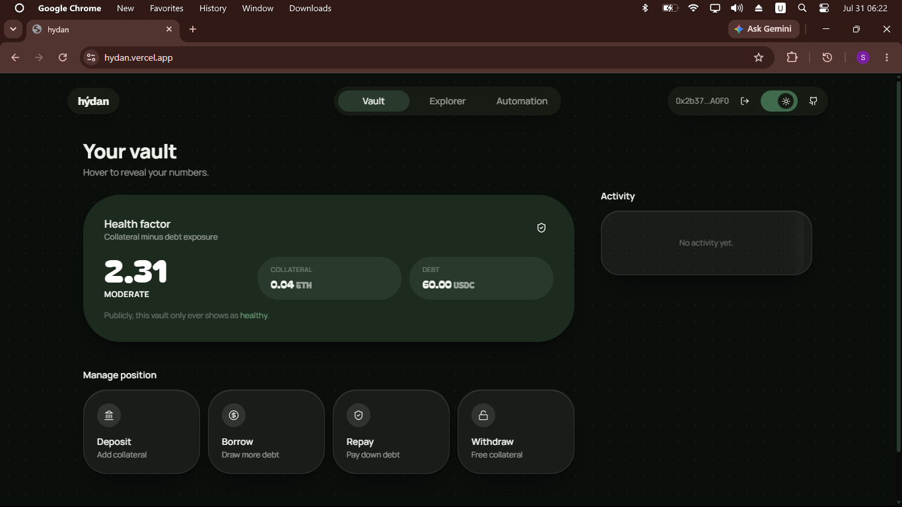

# hydan

Private lending vault on Sepolia: deposit WETH, borrow USDC — your balance and debt live on-chain as **Nox-encrypted handles that only you can decrypt**, not as plaintext numbers.



## Deployed (Sepolia)

| Item             | Address                                      |
| ---------------- | -------------------------------------------- |
| HydanVault       | `0x330b5c509bc1621585e88dc4c07b763e4a399fba` |
| asset (WETH)     | `0xC558DBdd856501FCd9aaF1E62eae57A9F0629a3c` |
| debtAsset (USDC) | `0x94a9D9AC8a22534E3FaCa9F4e7F2E2cf85d5E4C8` |
| Aave Pool        | `0x6Ae43d3271ff6888e7Fc43Fd7321a503ff738951` |
| Aave aWETH       | `0x5b071b590a59395fE4025A0Ccc1FcC931AAc1830` |

Frontend: **https://hydan.vercel.app**

## How it works

- **Deposit** — `deposit(assets, receiver, encryptedAssets, inputProof)`. You encrypt the amount off-chain; the vault pulls the WETH, supplies it to Aave, and stores `balanceOf[user]` as a **unique ciphertext handle**. The handle is never made publicly decryptable: the gateway answers `/v0/public/{handle}` with `403`, and only you (added as viewer) can decrypt it.
- **Borrow** — `prepareBorrow(...)` registers two encrypted handles, then `borrow(...)` verifies a TEE-produced decryption proof on-chain, draws USDC from Aave, and records `debtOf[user]` as another private handle. (The borrow _amount_ is public — Aave emits it anyway — but your stored _debt balance_ is not.)
- **Withdraw** — `prepareWithdraw(assets, onBehalfOf)` runs the balance check as an **encrypted comparison** inside the TEE and reveals only a boolean "has enough". `withdraw(...)` verifies that boolean **plus** the books-invariant boolean, then caps at `maxWithdrawable()` so the vault never drops to liquidation.
- **Repay** — `repay(...)` sends USDC to Aave and subtracts it from your encrypted `debtOf` handle.

**Soundness without seeing the numbers:** the vault keeps an encrypted `aggregateBalance` and a plaintext `totalDeposited`. Withdrawals require proof that `aggregateBalance == totalDeposited`, so nobody can cash out an overstated balance. The one thing the TEE ever reveals is booleans.

## Privacy, honestly

What's actually private vs. public in the deployed demo:

- **Private:** your stored `balanceOf` and `debtOf`. Verified on-chain: both are unique handles, both return `403` on the public endpoint, and only the owner's keys decrypt them to the right values.
- **Public (by necessity):** the vault's aggregate Aave position (aToken balance, debt tokens, health factor), your borrow/repay transaction amounts (Aave emits them), and the two withdrawal booleans.
- **Known limitations:** the withdraw-approval boolean is a public oracle — an attacker could in principle probe "does balance ≥ X" if they could trigger it; the contract now restricts `prepareWithdraw` to the position owner to close this. Nox encryption is randomized (unique handle per encryption), so stored ciphertexts can't be equality-matched against re-encrypted guesses.

## Stack

- **Contracts**: Solidity 0.8.35, Hardhat 3, Nox SDK (`euint256`/`ebool`)
- **Yield**: Aave V3 Sepolia
- **Privacy**: Nox TEE protocol + gateway decryption proofs
- **Frontend**: Vite + React, wagmi/viem, Tailwind CSS

## Dev

Secrets (Hardhat 3 uses its vars store; plain scripts read `.env`):

```bash
npx hardhat vars set SEPOLIA_RPC_URL
npx hardhat vars set SEPOLIA_PRIVATE_KEY
```

Build, deploy, and create the live position:

```bash
pnpm install
pnpm compile
set -a; source .env; set +a
node scripts/deployNewWETH.mjs     # deploy + configure Aave
node scripts/v3_position.mjs       # deposit WETH + borrow USDC + verify privacy
```

Testnet helpers (fund a fresh wallet):

```bash
pnpm mint:weth   # wraps ETH into WETH
pnpm mint:usdc   # mints USDC via the Aave faucet
```

Frontend:

```bash
cd frontend
cp .env.example .env    # set VITE_SEPOLIA_RPC_URL
npm install
npm run dev
```

## Design

Pacifico wordmark, Bagel Fat One numerics, carmine + leaf green palette. JetBrains Mono for code values. No rounded corners, no gradients, no glows. Borderless cards. 8pt spacing grid.
